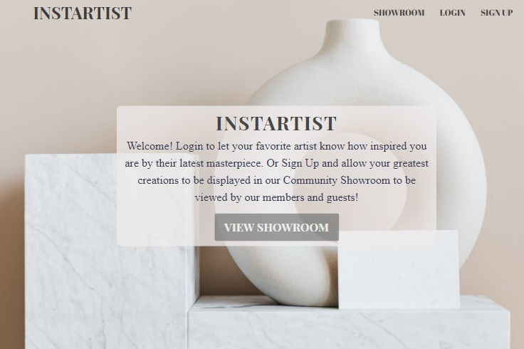
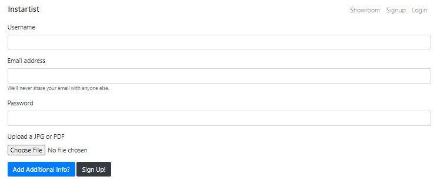
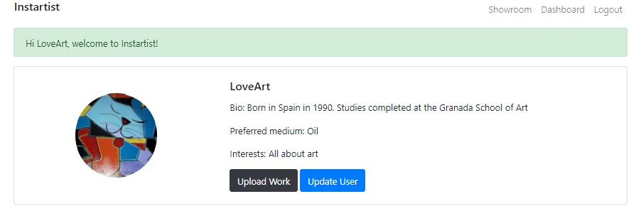
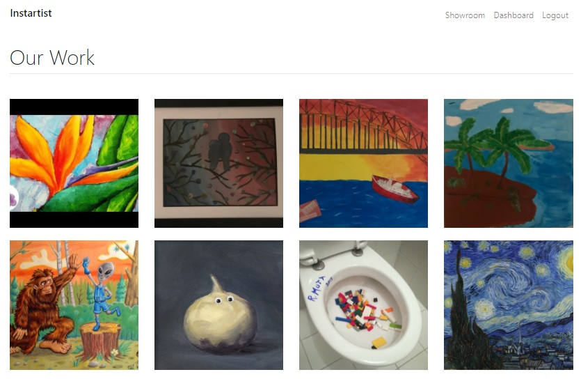
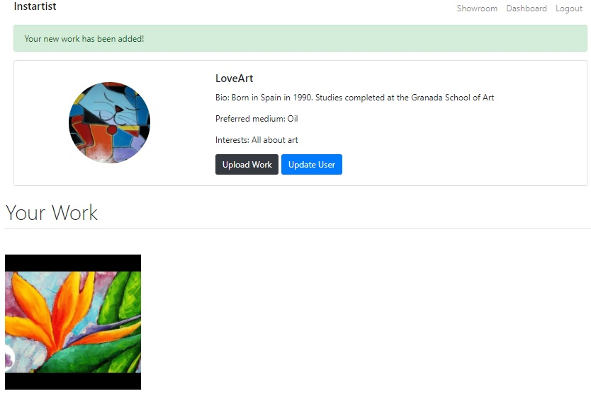

# *INSTARTIST*

  

# Description

Instartist is a social media application for virtually exhibiting works created by artists; provides a community to display and share the perspective of works of art of all kinds, where users can interact with these works and leave their comments. Both artists and users will create their accounts where they can upload a profile picture and information about themselves.

 

 ### Visit the site! [Instartist](https://instartist.herokuapp.com/)

# Table of Contents

[Usage](#Usage)

[License](#License)

[Technologies](#Technologies)

[Questions](#Questions)

 

# Usage 
 - The user or artist must **Signup**. If you wish, you can enter the additional information that is required.

  

     - The dashboard is shown with the information provided.

  

 
- All the works published by artists are shown in **Showroom** through images. If you want to see details of the works you must click on the image.

- The user can leave a comment on the work if he wishes.

- If you want to publish a work once signup you will click on **Dashboard** and choose the **Uploap Work** button, where you will write the characteristics of your work and select an image of your work.

- You have the option to edit a user by clicking on the **Update User** button once in **Dashboard**.

# License
The license for which the application is covered:
NONE 

# Technologies 
 
- NODE.JS
- BCRYPT
- DOTENV
- MYSQL2
- EXPRESS.JS
- EXPRESS-SESSION
- EXPRESS-HANDLEBARS
- SEQUELIZE
- CONNECT-SESSION-SEQUELIZE
- CLOUDINARY
- MULTER
- MULTER-STORAGE-CLOUDINARY
- JAVASCRIPT
- OBJECT ORIENTED PROGRAMMER
- MODEL-VIEW-CONTROLLER
- APIs
- CONNECT-FLASH
- HTML/CSS
- BOOTSTRAP	
- GITHUB
- HEROKU

    
# Contributors
- DARIUS WRIGHT
- DEMARIO WILLIAMS
- ANNIA VALDES	
- CHRISTOPHER CONCANNON
- CLAUDIA LAY

# Questions

  If you have questions about the project, below you can find ways to answer them, either by visiting our hithub or contacting us by email.
  
  Link to  Github:
  - [Darius](https://github.com/DariusJWright)
  - [Demario](https://github.com/DWill1440)
  - [Annia](https://github.com/avdiaz)
  - [Christopher](https://github.com/christopherConcannon)
  - [Claudia](https://github.com/layc41)

 
  Email acount:
- Darius: [dwright758@gmail.com](mailto:dwright758@gmail.com)
- Demario: [dwill2thin@gmail.com](mailto:dwill2thin@gmail.com)
- Annia: [annia.valdes@gmail.com](mailto:annia.valdes@gmail.com)
- Christopher: [cmcon@yahoo.com](mailto:cmcon@yahoo.com)
- Claudia: [claudialay41@gmail.com](mailto:claudialay41@gmail.com)
